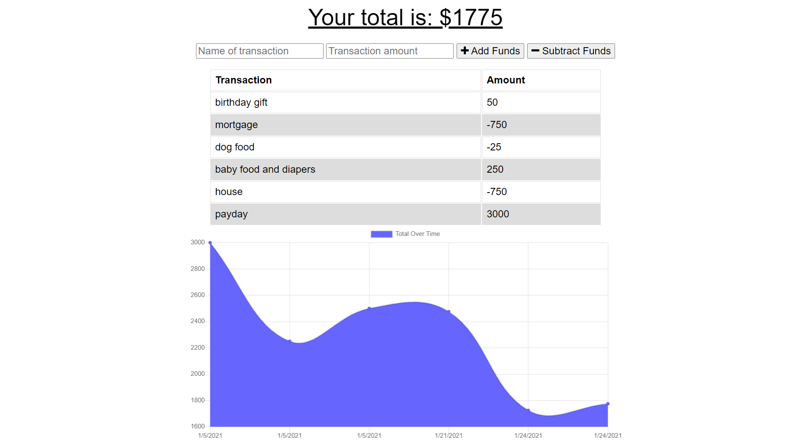

# Budget-Tracker-PWA
[](https://opensource.org/licenses/MIT)

(https://safe-escarpment-35566.herokuapp.com/)

A PWA app to keep track of your monthly expenses
## Table of contents
* [General info](#general-info)
* [Technologies](#technologies)
* [Install](#install)

## General info
This application uses a MongoDB database to keep track of spending and deposits into a monthly budget. 
	
## Technologies
Project is created with:
* Javascript
* Node.js 
* Express.js
* Mongoose
* Morgan 
* Compression
* Lite-server

## Install
To install locally, download the repository. Make sure you have node.js installed. Open your terminal and run

``` npm install ``` 

To start the application

``` npm start``` 

